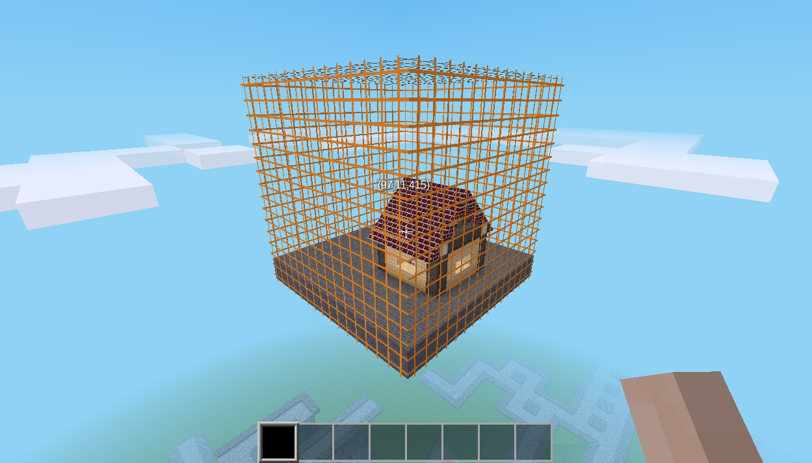

# mapblock_lib

[](https://content.minetest.net/packages/BuckarooBanzay/mapblock_lib/)


[](https://coveralls.io/github/BuckarooBanzay/mapblock_lib?branch=main)

Mapblock-granular world operations, transformations and utilities



Features:

* Load/Save mapblocks from/to disk
* Serializes param1/param2/nodetimers and metadata
* Transforms mapblock data on the fly (rotation, orientation, replacements)
* Supports caching of the loaded mapblocks for fast in-world placement (mapgen)
* Adds position dependent data-storage (`mapblock_lib.create_data_storage(mod_storage)`) with caching

Use-cases:

* Custom mapgens with pre-built schematics
* Building-mods

Demo:

* [City mapgen](https://github.com/BuckarooBanzay/citygen)
* [Mapblock tileset](https://github.com/buckarooBanzay/mapblock_tileset)

## Chatcommands

### Single mapblock operations

* `/mapblock_show` marks the current mapblock with a grid
* `/mapblock_rotate_y [90,180,270]` rotates the current mapblock around the y axis
* `/mapblock_mark`,`/mb_mark` (only available if the `worldedit` mod is present) marks the current mapblock with worledit

### Multi-mapblock operations

* `/mapblock_pos1`,`/mb_pos1` marks the pos1 for a multi-mapblock ex-/import
* `/mapblock_pos2`,`/mb_pos2` marks the pos2 for a multi-mapblock ex-/import
* `/mapblock_save [path|modname:path]`,`/mb_save [path|modname:path]` saves the mapblock region
* `/mapblock_load [path|modname:path]`,`/mb_load [path|modname:path]` loads a saved mapblock region
* `/mapblock_allocate [name]`,`mb_alloc [name]` allocates and displays the affected region

The parameter `path|modname:path` can be either a file in `<world_path/mapblocks/<path>`
or, if a ":" delimiter is found and the `mapblock_lib` is a trusted mod: a file in the modpath `<modname-path>/<path>`

For example:
* `/mb_load xy` loads the schematic from `<world_path>/mapblocks/xy.zip`
* `/mb_load mymod:schematics/abc` loads the schematic `schematics/abc.zip` from the `mymod` mod-path (`mapblock_lib` has to be a trusted mod)

# Api

## `create_catalog(filename, pos1, pos2, options)`

Creates a mapblock-catalog from the given mapblock range

```lua
local filename = minetest.get_worldpath() .. "/my-mapblocks.zip"
local mb_pos1 = { x=0, y=0, z=0 }
local mb_pos2 = { x=1, y=1, z=1 }
local options = {
    -- optional: delay between operations
    delay = 0.2,
    -- optional: called when done
    callback = function()
        print("done!")
    end,
    -- optional: called with current progress
    progress_callback = function(p)
        print("progress: " .. p) -- 0 ... 1
    end
}

mapblock_lib.create_catalog(filename, mb_pos1, mb_pos2, options)
```

## `get_catalog(filename)`

Parses a previously create mapblock catalog

```lua
local filename = minetest.get_worldpath() .. "/my-mapblocks.zip"

local catalog, err = mapblock_lib.get_catalog(filename)
if err then
    -- sometehing went wrong
    error(err)
end

-- get size in mapblocks
local size = catalog:get_size()
-- size, for example: { x=1, y=1, z=1 }

-- check if a mapblock exists within the catalog
if catalog:has_mapblock({ x=0, y=0, z=0 }) then
    -- do stuff
end

-- deserialize a single mapblock into the world
local catalog_mapblock_pos = { x=0, y=0, z=0 }
local world_mapblock_pos = { x=10, y=0, z=5 }
-- all fields are optional
local options = {
	-- various transformations to apply to the loaded mapblock
	transform = {
		-- rotate the mapblock around the given axis with the angle (90, 180, 270)
		rotate = {
			angle = 90,
			axis = "y",
			-- disables param2 orientation for the given nodes
			disable_orientation = {
				["default:sandstonebrick"] = true
			}
		},

		-- replace certain nodes with others
		replace = {
			["default:dirt"] = "default:mese"
		},

		-- bulk set param2 for certain nodes, useful for mass-coloring
		set_param2 = {
			["unifiedbricks:brickblock"] = 15
		}
	},

	-- metadata callback, can be used to intercept and modify node-metadata/inventory
	on_metadata = function(pos, content_id, meta)
		-- resolve nodename (use a var here for better performance)
		local nodename = minetest.get_name_from_content_id(content_id)
		if nodename == "default:chest_locked" then
			print(minetest.pos_to_string(pos), nodename)
			-- set new owner
			meta:set_string("owner", "nobody")
		end
	end,

	-- placement mode "replace": replace the whole mapblock, "add": replace only air nodes
	mode = "replace"
}

local success, err = catalog:deserialize(catalog_mapblock_pos, world_mapblock_pos, options)
if err then
    -- sometehing went wrong
    error(err)
end


-- deserialize all mapblocks to position 1,1,1 without any callback
local success, err = catalog:deserialize_all({x=1,y=1,z=1})

-- deserialize all mapblocks to position 1,1,1 with options
local success, err = catalog:deserialize_all({x=1,y=1,z=1}, {
	-- delay between mapblock exports in seconds (default is 0.2)
	delay = 1,
	callback = function(count, micros)
		-- called after the export is done
		print("Imported " .. count .. " mapblocks in " .. micros .. " us")
	end,
	progress_callback = function(f)
		-- progress is a fractional number from 0 to 1
		print("Progress: " .. (f*100) .. "%")
	end,
	error_callback = function(import_err)
		-- handle errors
		error(import_err)
	end
})

-- load and prepare a mapblock for faster access (mapgen)
local deserFn, err = catalog:prepare({x=0,y=0,z=0}, options)
if err then
	error(err)
end
-- apply to the given position
deserFn({x=1,y=1,z=1})

```

# License

* Code: MIT
* Textures: CC-BY-SA 3.0


